# Báo cáo EDA — MILK10k

_Sinh tự động bởi `EDA/eda.py`. Hình trong `figures/`, bảng chi tiết trong `tables/`._

## 1. Tổng quan

MILK10k là bộ dữ liệu tổn thương da: **mỗi lesion có đúng 2 ảnh** — 1 ảnh lâm sàng (clinical close-up) và 1 ảnh dermoscopy — kèm metadata (tuổi, giới, skin tone, vị trí) và 7 điểm khái niệm MONET cho mỗi ảnh. Bài toán: phân loại 11 lớp chẩn đoán (one-hot).

| file           |   rows |   cols |   unique lesion_id |
|:---------------|-------:|-------:|-------------------:|
| train_combined |   5240 |     34 |               5240 |
| test_combined  |    479 |     23 |                479 |
| GroundTruth    |   5240 |     12 |               5240 |
| Train Metadata |  10480 |     17 |               5240 |
| Test Metadata  |    958 |     17 |                479 |
| train_fold0    |   4716 |     34 |               4716 |
| val_fold0      |    524 |     34 |                524 |

- Tổng ảnh: **10480 train + 958 test**, định dạng JPG, mode ảnh: RGB=11438.
- `*_combined.csv` là bản 'wide' gộp 2 ảnh/lesion vào 1 hàng (tiền tố `clin_` / `derm_` cho MONET).
- `splits/` chứa fold 0 của một cách chia train/val: 4716 / 524 lesion (10% val).

## 2. Kiểm tra tính toàn vẹn

| Kiểm tra | Kết quả |
|---|---|
| Ground truth one-hot (mỗi lesion đúng 1 nhãn) | ✅ Đạt |
| Nhãn chỉ gồm 0/1 | ✅ Đạt |
| train_combined khớp GroundTruth | ✅ Đạt |
| Train ∩ Test lesion_id rỗng | ✅ Đạt |
| fold0 train ∩ val rỗng | ✅ Đạt |
| fold0 train ∪ val = toàn bộ train | ✅ Đạt |
| Metadata train: mỗi lesion có 2 ảnh | ✅ Đạt |
| Metadata test: mỗi lesion có 2 ảnh | ✅ Đạt |
| Không trùng isic_id giữa train và test | ✅ Đạt |
| Không có lesion trùng lặp trong train_combined | ✅ Đạt |
| Ảnh train tồn tại đầy đủ (thiếu 0) | ✅ Đạt |
| Ảnh test tồn tại đầy đủ (thiếu 0) | ✅ Đạt |

Loại ảnh và mức chỉnh sửa ảnh:

| image_type         |   test |   train |
|:-------------------|-------:|--------:|
| clinical: close-up |    479 |    5240 |
| dermoscopic        |    479 |    5240 |

| image_manipulation   |   test |   train |
|:---------------------|-------:|--------:|
| altered              |     29 |     335 |
| instrument only      |    929 |   10145 |

## 3. Giá trị thiếu

|            |   train_missing |   test_missing |   train_% |   test_% |
|:-----------|----------------:|---------------:|----------:|---------:|
| age_approx |              20 |              0 |      0.38 |     0    |
| site       |              31 |              6 |      0.59 |     1.25 |

## 4. Phân bố nhãn

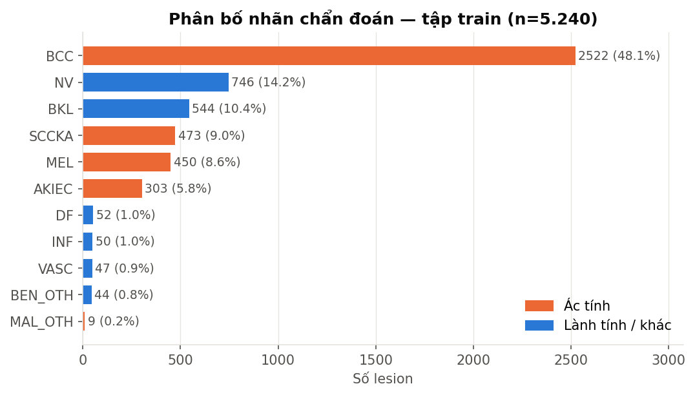

| label   |   count |   percent | malignant   |
|:--------|--------:|----------:|:------------|
| BCC     |    2522 |     48.13 | True        |
| NV      |     746 |     14.24 | False       |
| BKL     |     544 |     10.38 | False       |
| SCCKA   |     473 |      9.03 | True        |
| MEL     |     450 |      8.59 | True        |
| AKIEC   |     303 |      5.78 | True        |
| DF      |      52 |      0.99 | False       |
| INF     |      50 |      0.95 | False       |
| VASC    |      47 |      0.9  | False       |
| BEN_OTH |      44 |      0.84 | False       |
| MAL_OTH |       9 |      0.17 | True        |

- **Mất cân bằng nặng**: lớp lớn nhất `BCC` (2522) gấp **280×** lớp nhỏ nhất `MAL_OTH` (9).
- Tỉ lệ ác tính (AKIEC, BCC, MAL_OTH, MEL, SCCKA): **71.7%**.
- Fold 0 được chia phân tầng — tỉ lệ từng lớp gần như giống hệt giữa train/val:

| label   |   full_% |   train_fold0_% |   val_fold0_% |   val_fold0_n |
|:--------|---------:|----------------:|--------------:|--------------:|
| AKIEC   |     5.78 |            5.79 |          5.73 |            30 |
| BCC     |    48.13 |           48.11 |         48.28 |           253 |
| BEN_OTH |     0.84 |            0.83 |          0.95 |             5 |
| BKL     |    10.38 |           10.39 |         10.31 |            54 |
| DF      |     0.99 |            1    |          0.95 |             5 |
| INF     |     0.95 |            0.95 |          0.95 |             5 |
| MAL_OTH |     0.17 |            0.17 |          0.19 |             1 |
| MEL     |     8.59 |            8.59 |          8.59 |            45 |
| NV      |    14.24 |           14.23 |         14.31 |            75 |
| SCCKA   |     9.03 |            9.03 |          8.97 |            47 |
| VASC    |     0.9  |            0.91 |          0.76 |             4 |

## 5. Nhân khẩu học & vị trí (train vs test)

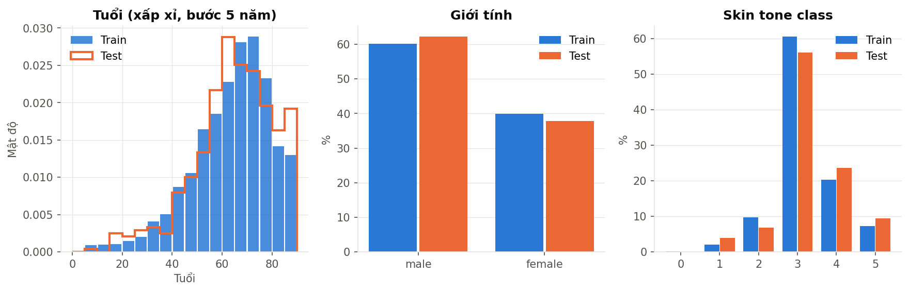

|            |   Train |   Test |
|:-----------|--------:|-------:|
| age_mean   |    61.4 |   62.2 |
| age_median |    65   |   65   |
| age_min    |     5   |    5   |
| age_max    |    85   |   85   |

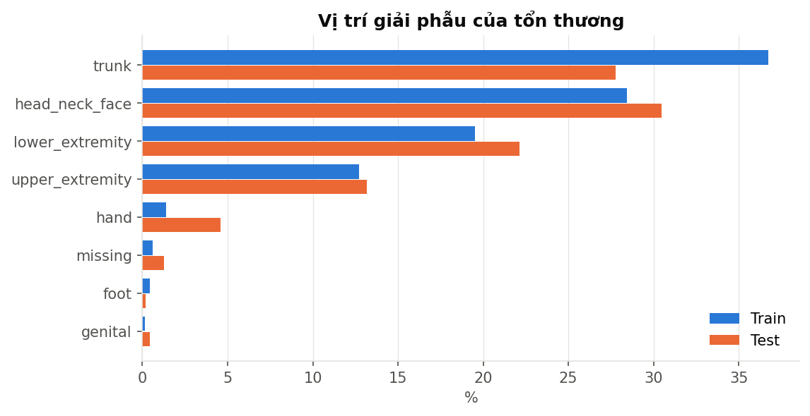

| site            |   Train_% |   Test_% |
|:----------------|----------:|---------:|
| trunk           |      36.7 |     27.8 |
| head_neck_face  |      28.5 |     30.5 |
| lower_extremity |      19.5 |     22.1 |
| upper_extremity |      12.7 |     13.2 |
| hand            |       1.4 |      4.6 |
| missing         |       0.6 |      1.3 |
| foot            |       0.4 |      0.2 |
| genital         |       0.2 |      0.4 |

## 6. Đặc trưng theo nhãn

### Tuổi

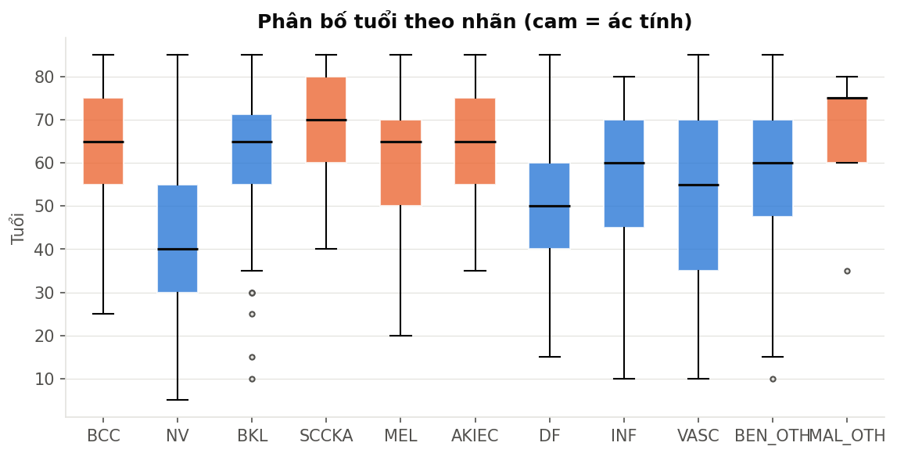

| label   |   count |   mean |   50% |   std |   min |   max |
|:--------|--------:|-------:|------:|------:|------:|------:|
| BCC     |    2522 |   64.9 |    65 |  11.8 |    25 |    85 |
| NV      |     729 |   42   |    40 |  17.7 |     5 |    85 |
| BKL     |     544 |   63.7 |    65 |  12.4 |    10 |    85 |
| SCCKA   |     473 |   69.5 |    70 |  11.2 |    40 |    85 |
| MEL     |     450 |   61.8 |    65 |  14.8 |    20 |    85 |
| AKIEC   |     303 |   65.9 |    65 |  12.3 |    35 |    85 |
| DF      |      52 |   50.4 |    50 |  14.4 |    15 |    85 |
| INF     |      50 |   55.6 |    60 |  17.3 |    10 |    80 |
| VASC    |      45 |   52   |    55 |  20.5 |    10 |    85 |
| BEN_OTH |      43 |   56.6 |    60 |  19.4 |    10 |    85 |
| MAL_OTH |       9 |   66.7 |    75 |  13.9 |    35 |    80 |

### Vị trí

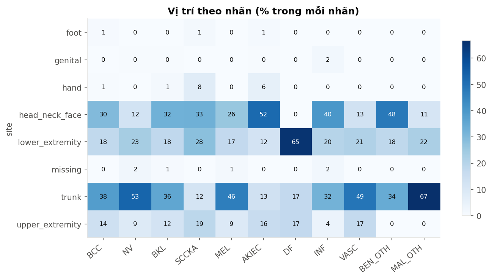

### Skin tone

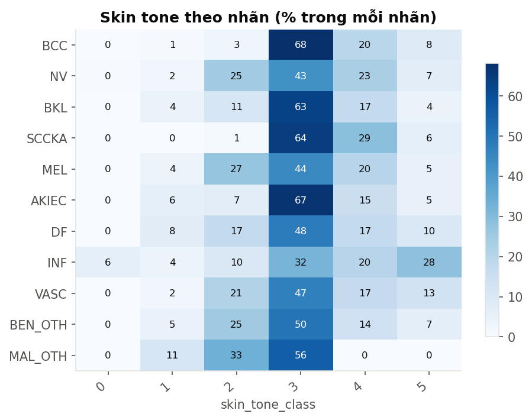

### Giới tính (% trong mỗi nhãn)

| label   |   female |   male |
|:--------|---------:|-------:|
| BCC     |     39.2 |   60.8 |
| NV      |     50.4 |   49.6 |
| BKL     |     42.5 |   57.5 |
| SCCKA   |     29.8 |   70.2 |
| MEL     |     36.9 |   63.1 |
| AKIEC   |     32.3 |   67.7 |
| DF      |     40.4 |   59.6 |
| INF     |     42   |   58   |
| VASC    |     55.3 |   44.7 |
| BEN_OTH |     43.2 |   56.8 |
| MAL_OTH |     11.1 |   88.9 |

## 7. Điểm khái niệm MONET

MONET là điểm xác suất (0–1) do mô hình MONET ước lượng cho 7 khái niệm trên mỗi ảnh.

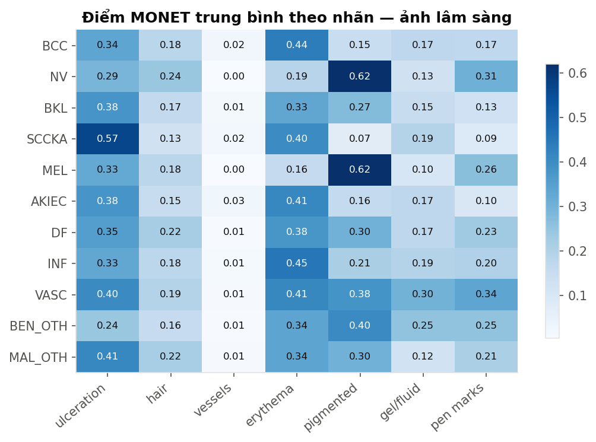

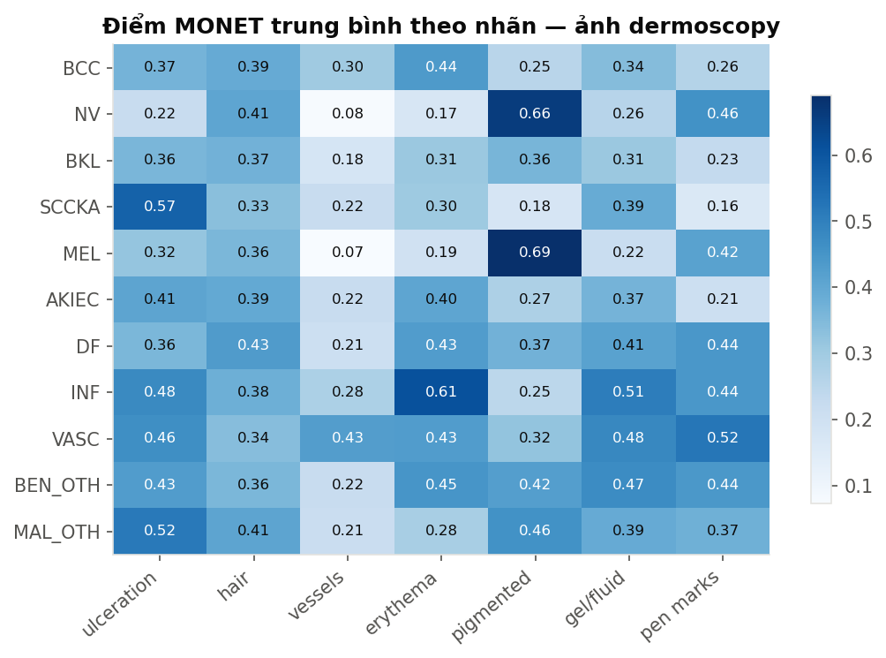

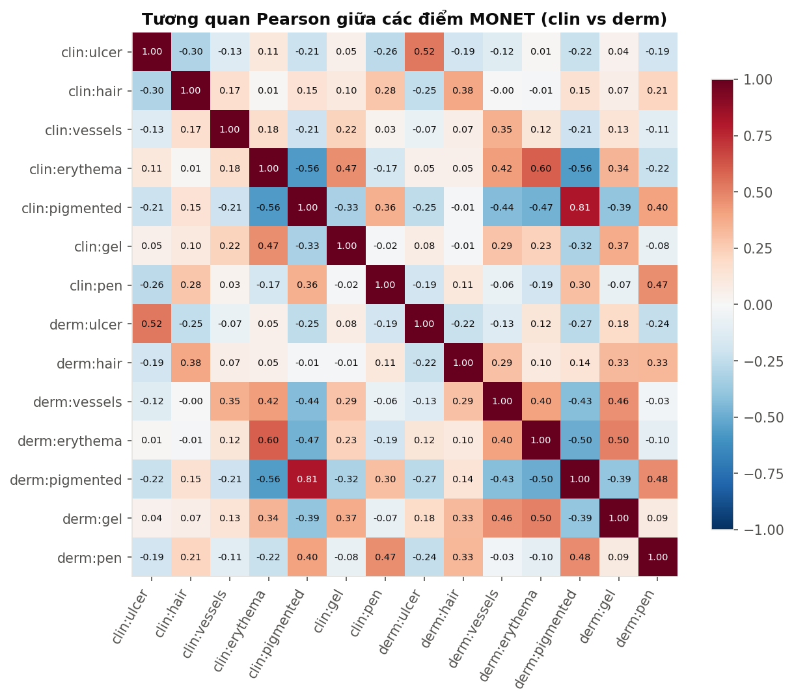

Tương quan giữa cùng một khái niệm trên ảnh clinical và dermoscopy:

| Khái niệm | r(clin, derm) |
|---|---|
| ulcer | 0.52 |
| hair | 0.38 |
| vessels | 0.35 |
| erythema | 0.60 |
| pigmented | 0.81 |
| gel | 0.37 |
| pen | 0.47 |

Chênh lệch trung bình MONET test − train (lớn nhất theo trị tuyệt đối):

|                                             |   train_mean |   test_mean |   diff |
|:--------------------------------------------|-------------:|------------:|-------:|
| clin_MONET_ulceration_crust                 |        0.356 |       0.424 |  0.068 |
| derm_MONET_ulceration_crust                 |        0.364 |       0.43  |  0.066 |
| derm_MONET_pigmented                        |        0.357 |       0.302 | -0.054 |
| derm_MONET_skin_markings_pen_ink_purple_pen |        0.295 |       0.255 | -0.039 |
| clin_MONET_pigmented                        |        0.268 |       0.231 | -0.037 |

## 8. Thuộc tính ảnh

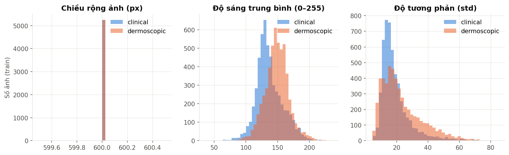

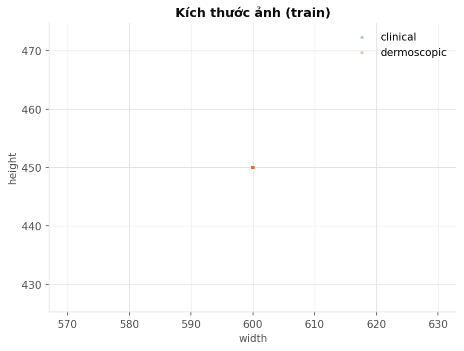

|                          |   file_kb_mean |   file_kb_min |   file_kb_max |   brightness_mean |   brightness_min |   brightness_max |   contrast_mean |   contrast_min |   contrast_max |
|:-------------------------|---------------:|--------------:|--------------:|------------------:|-----------------:|-----------------:|----------------:|---------------:|---------------:|
| ('test', 'clinical')     |           39.4 |          13.7 |          82.4 |             135.1 |             63.1 |            208.2 |            20.1 |            5.4 |           66.7 |
| ('test', 'dermoscopic')  |           27.7 |          14.7 |          62.9 |             146.2 |             83.2 |            215.4 |            23.4 |            4.7 |           84.6 |
| ('train', 'clinical')    |           39.1 |          11.5 |          99.1 |             137   |             36.6 |            218.7 |            19.2 |            4.9 |           81.6 |
| ('train', 'dermoscopic') |           27   |          12.2 |          74.1 |             148.8 |             52.7 |            235.6 |            23.3 |            4.6 |           85   |

Kích thước phổ biến nhất:

|                            |   count |
|:---------------------------|--------:|
| ('clinical', '600x450')    |    5719 |
| ('dermoscopic', '600x450') |    5719 |

Độ sáng trung bình theo nhãn:

| label   |   clinical |   dermoscopic |
|:--------|-----------:|--------------:|
| BCC     |      136.9 |         150.2 |
| NV      |      144.4 |         151.9 |
| BKL     |      133.6 |         146.8 |
| SCCKA   |      132.5 |         138.9 |
| MEL     |      138.3 |         150.4 |
| AKIEC   |      129.6 |         143   |
| DF      |      138   |         154   |
| INF     |      143.1 |         158.8 |
| VASC    |      148.4 |         151.7 |
| BEN_OTH |      128.9 |         151.6 |
| MAL_OTH |      126.5 |         162.2 |

## 9. Ảnh mẫu

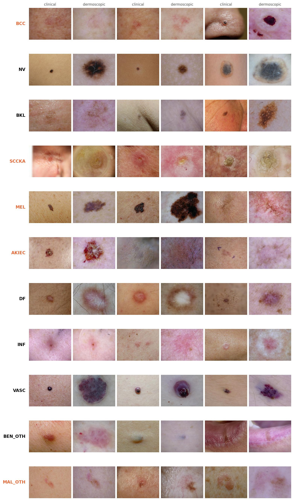

## 10. Nhận xét & khuyến nghị

### Chất lượng dữ liệu
- Dữ liệu **sạch**: nhãn one-hot hợp lệ, không rò rỉ lesion/ảnh giữa train–test và giữa train–val fold 0, đủ 100% ảnh.
- Thiếu rất ít: `age_approx` (20 lesion train, 0.4%) và `site` (31 train / 6 test). Có thể điền median tuổi và thêm hạng mục `unknown` cho site.
- Mọi ảnh đều **600×450 RGB** (đã chuẩn hoá sẵn). Khi resize về ảnh vuông cần xử lý tỉ lệ 4:3 (pad hoặc random-resized-crop).
- ~3% ảnh có `image_manipulation = altered` — có thể dùng làm feature hoặc kiểm tra riêng.

### Phân bố nhãn — thách thức chính
- **BCC chiếm ~48%**; 5 lớp hiếm (DF, INF, VASC, BEN_OTH, MAL_OTH) cộng lại chỉ ~3.9%. `MAL_OTH` chỉ có **9 mẫu** (1 mẫu ở val fold 0) → điểm số val cho các lớp này rất nhiễu.
- Khuyến nghị: dùng **5-fold stratified CV** thay vì chỉ fold 0; weighted / focal loss hoặc logit-adjustment, oversampling lớp hiếm; đánh giá bằng **balanced accuracy / macro-F1 / macro-AUC** thay vì accuracy.

### Metadata mang tín hiệu mạnh
- **Tuổi**: NV trẻ hơn rõ rệt (median 40) so với BCC/SCCKA/AKIEC (65–70). DF, VASC, INF cũng trẻ hơn (~50–55).
- **Vị trí**: AKIEC tập trung ở đầu-mặt-cổ (52%); SCCKA/AKIEC xuất hiện ở bàn tay nhiều hơn hẳn các lớp khác; DF ở chi dưới (65%); NV, MEL, VASC chủ yếu ở thân mình.
- **Giới**: SCCKA, AKIEC, MAL_OTH thiên về nam (≥68%); NV cân bằng.
- **Skin tone**: đa số ở lớp 3–4, lớp 0 gần như không có → mô hình có thể tổng quát hoá kém cho nhóm skin tone hiếm.
- → Nên xây **mô hình đa phương thức** (ảnh + metadata), ví dụ nối embedding ảnh với vector metadata đã mã hoá.

### MONET
- `pigmented` (dermoscopy) cao ở **NV và MEL (~0.62)**, rất thấp ở SCCKA (0.07) → tách tốt nhóm sắc tố / không sắc tố.
- `ulceration_crust` cao nhất ở **SCCKA**; `erythema` cao ở BCC/AKIEC/INF; `vessels` (clinical) cao nhất ở VASC.
- MONET clinical và dermoscopy chỉ tương quan vừa phải (r 0.35–0.81) → hai ảnh mang thông tin bổ sung, nên giữ cả 14 điểm.
- `pen marks` cao ở NV/MEL — đây là **artifact** (vết bút đánh dấu) có nguy cơ gây shortcut learning.

### Hai modality ảnh
- Ảnh dermoscopy sáng và tương phản hơn ảnh clinical, dung lượng file nhỏ hơn → nên normalize/augment riêng cho từng modality, hoặc dùng backbone 2 nhánh rồi fusion.

### Train vs Test
- Tuổi, giới, skin tone tương đồng. Lệch nhẹ: test ít `trunk` hơn (27.8% vs 36.7%), nhiều `hand` hơn (4.6% vs 1.4%); MONET `ulceration` cao hơn và `pigmented` thấp hơn ở test → test **có thể** có nhiều SCCKA/AKIEC hơn và ít NV/MEL hơn train. Cẩn thận khi hiệu chỉnh ngưỡng theo prior của train.
